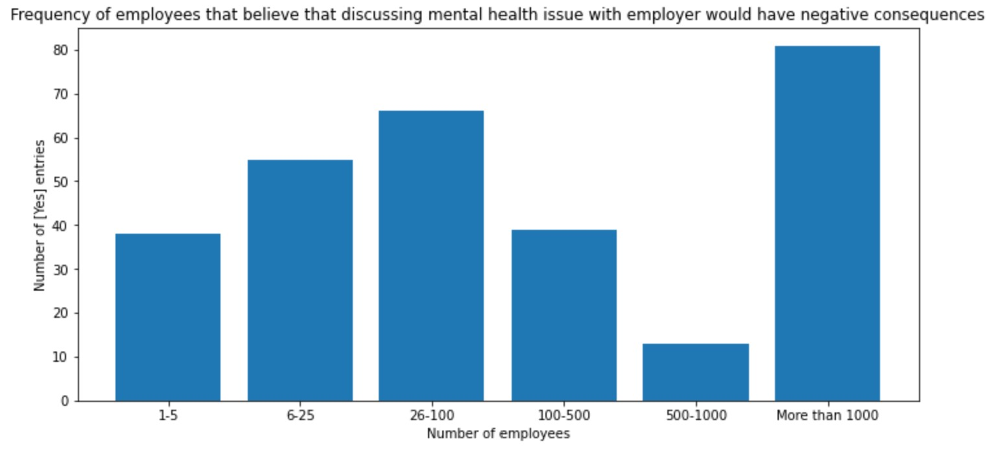
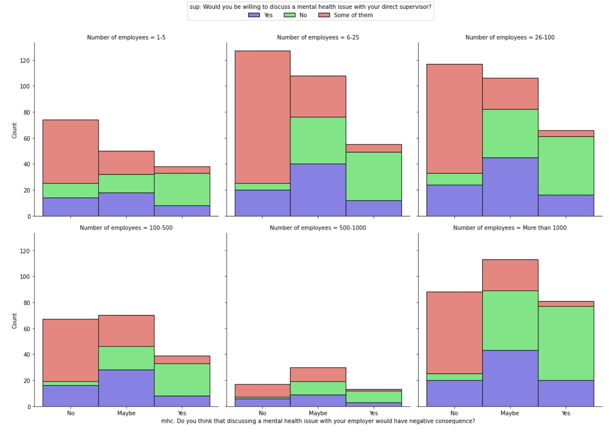
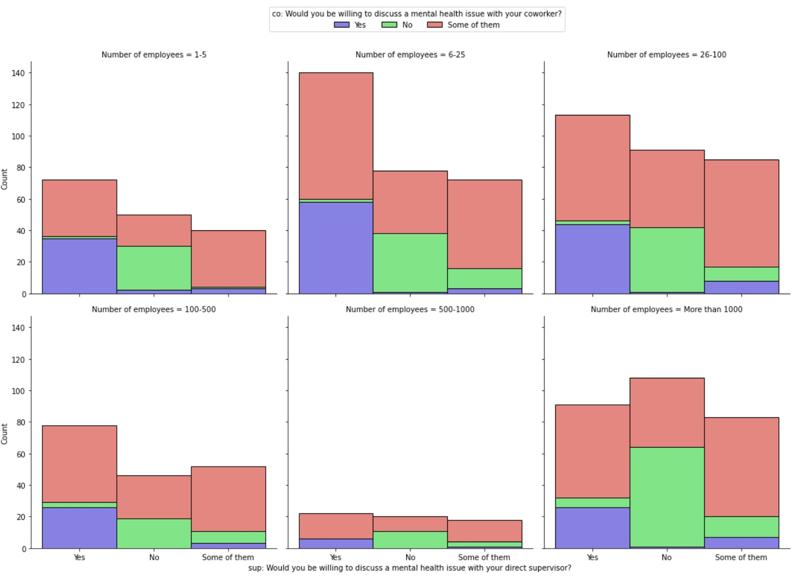
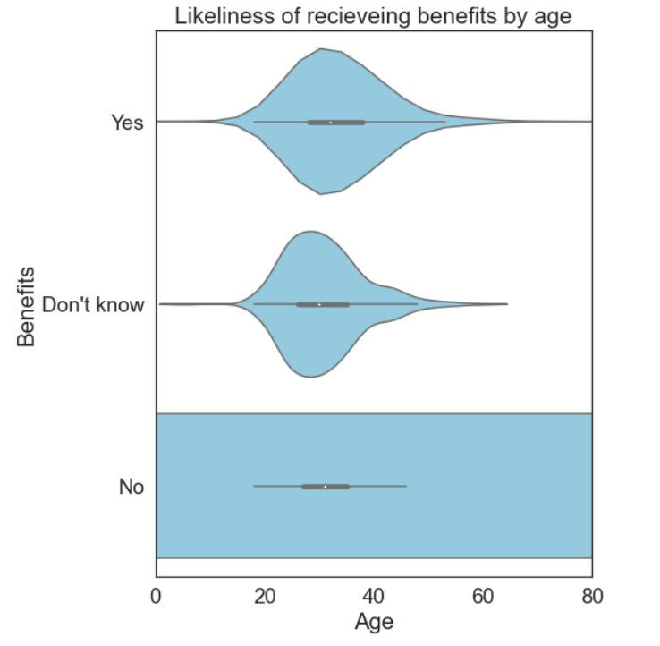
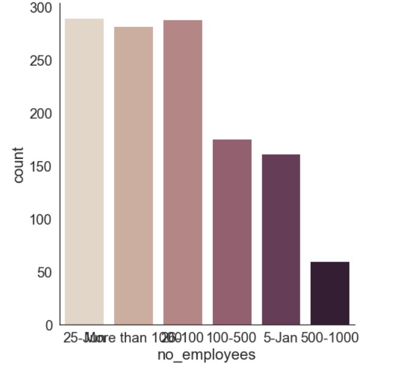
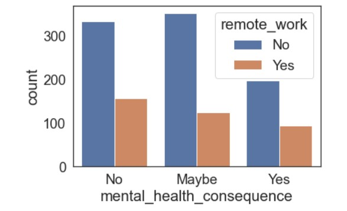
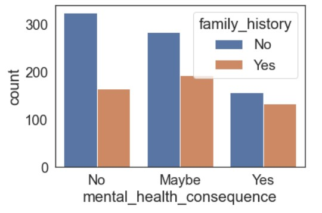
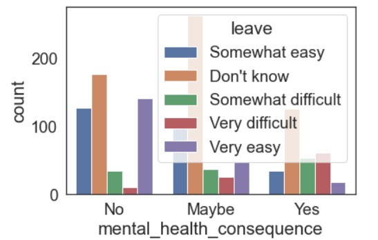
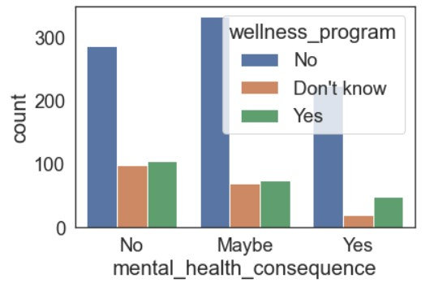

# Task 4 - Analysis

## Carolina

Research question: Is there a correlation between the number of employees in a company and how open employees are to discuss mental health?

Hypothesis:
    I predict that employees are less willing to discuss mental health in the workplace as the number of employees in a company increases. This is because the relations between coworkers, and workers and supervisors are more distant amd superficial in big companies.

### Analysis plan

1.Compare mental health consequence variable with the number of employees along with supervisor variable.

Goal: observe the employees' expectations across companies (with different sizes) when discussing a mental health issue with employers, and if the fear of a negative consequence impact their willingness to talk about mental health with supervisors.

2.Compare supervisor variable with the number of employees along with coworkers variable.
  
Goal: observe if employees are more open to talk about mental health with coworkers than with supervisors, and how this openess change across companies with different number of employees.

### 1. Number of employees vs. Mental health consequence vs. Supervisor

Figure 1. Frequency of "Yes" entries to the question "Do you think that discussing a mental health issue with your employer would have a negative consequence?" across tech organizations with different number of employees. 

- Out of 292 "Yes" entries, 81 (27.7%) came from workers of tech companies that have more than 1000 employees.
- 13% were from workers in companies with 1-5 employees, 18.8% 6-25 employees, 22.6% were 26-100 employees, 13.4% 100-500 employees, 4.5% 500-1000 employees, and 27.7% in companies with more than 1000 employees.
- Concrete conclusions cannot be drawn solely from this plot as the sample size differ across companies sizes.

Figure 2. The employees' expectations when discussing a mental health issue with an employer across tech companies with different number of employees. The trend between the two variable is observed along the employees' willingness to discuss a mental health issue with their supervisor. The data was collected from 1259 tech employees' answers to a suvey. There is a relevant correlation between the number of employees and the mental health consequence variable (χ2 contingency test, df= 10, χ2= 21.14, p-value= 0.02).

If small companies have less than 100 employees and big companies have more than 100, the data demostrates that employees from small tech companies are more confident that discussing a mental health issue with employers do not have negative consequences than employees from big tech companies. Alhtough "Maybe" is not equivalent to "Yes", both answers points to similar conclusions, which the responder would not be open to talk about a mental health issue with employer since they believe (certainly or not) that it could have negative consequences.
​
When comparing with the question: "Would you be willing to discuss a mental health issue with your direct supervisor?", it is conclusive that people that believe that mental health discussion with employers can have negative consequences are less likely to be willing to have the same disussion with direct supervisors. On the other hand, people that think that discussing a mental health issue with employers does not have negative consequences are more likely to be willing to discuss a mental health issue with some direct supervisors.

### 2. Number of employees vs. Supervisor vs. Coworkers

Figure 3. The employees' willingness to discuss a mental health issue with their supervisor across tech companies with different number of employees. The trend between the two variables is observed along the employees' willingness to discuss a mental health issue with their coworkers. The data was collected from 1259 tech employees' answers to a survey. There is a relevant correlation between the number of employees and the supervisor variable (χ2 contingency test, df= 10, χ2= 20.60, p-value= 0.02). There is also a relevant correlation between the number of employees and the coworkers variable (χ2 contingency test, df= 10, χ2= 28.45, p-value= 0.001)

Looking at the count of the supervisor column, the number of employees that are willing to discuss mental health issue with any direct supervisor is higher in organizations with less than 500 employees. On the other hand, the number of "No" answers outstand "Yes" and "Some of them" in companies with more than 500 employees. Even though "Yes" and "Some of them" are segregated in the plot, logically, they can both be interpreted as employees being open to discuss mental health. However, the plot shows that small companies have a significant higher "Yes" frequency than "Some of them". This may suggest that all the relationships in small organizations are more intimal or open as employees are willing to talk about mental health with any supervisor.

When comparing the supervisor variable with the coworker variable, it is observed that employees that are open to have a discussion with any direct supervisor are also open to have a discussion with any or some coworkers. The frequency of people that are willing to talk about mental health with supervisors but not with coworkers is generally low. Nonetheless, the frequency is a little bit higher in big companies. Employees that would not talk about mental health with supervisors would either not talk to any coworker or would talk to some of them for every company size. Overall, the employee likelihood of being open to discuss a mental issue with the direct supervisor and coworkers (the intersection between supervisor and coworker variable) is not interfered by the number of employees.

### Conclusion

Research question: Is there a correlation between the number of employees in a company and how open employees are to discuss mental health?

- Employees are more confident that discussing a mental health issue with employers do not have negative consequences in organizations with less than 100 employees.
- Employees that believe that mental health discussion with employers can have negative consequences are less likely to be willing to have the same disussion with direct supervisors.
- Employees are more whilling to discuss mental health issue with any direct supervisor in companies with less than 500 employees.
- Employees that are whilling to discuss a mental health issue with any of their direct supervisor are also whilling to have he same discussion with any coworker or some of them. 
- The Chi-Square test showed that there is a significant correlation between the number of employees in a tech company and the three variables utilized to measure employees' openess to discuss mental health (mhc, sup, and co).
- Based the openess for mental health discussion on the three variables, the analysis shows a negative correlation between the number of employees in a company and how open employees are to discuss mental health. The likelihood of an employee to be open to discuss mental health decreases as the comapny size increases.

## Mohammed

**Research question:**What does this data tell us are the biggest factors that affects the mental health of employees?

**Hypothesis:**
    My prediction is that people are more likely to develop mental health issues as they age or especially as they dont go on leave. As people age to they tend to be alble to get more work benfits since they have accumulated more work experience and are therefore more likely will want to confine any issues with mental health as they may not able to disclose it to public. Some people of which recive benefits as well may not be developing mental health problems. 

**Anaysis:** 

### 1. Benefits recieved by employees vs Age of employee.  

Graph1: The Analysis shown above shows that older employees tend to recieve benfits than those younger which could be a reson why older people may sometimes be less likely to have work have a mental consequence on them. The fact that older employees are more likely to recive work benefits compared to other younger employees could help in preventing older employees developing mental health consequences and could be a reason as to why some may be developing mental health issues but refuse to talk about it to people that offer help. There is a dignificant about of elderly employees that although they have recieved benefits that have developed mental health conseqences which may lead to the fact the two factors are not correlated.  

### 2. Number of employees vs Mental health consequences.

Graph2: From hear we can see that most companies tend to have a number of employees that ranges from 0 to 1000. There is a possiblility that by lowering the number of employees, the less chance there would be a mental consequence on employees, since companies that have a lower number of employees may be able to provide better support to its employees. However this does not not yet sya any thing to as to wheather number of employees has any correlation with employees developing mental health problems or no. 

### 3. Age of employee vs Mental health consequences.  

Graph3: This shows that older aged employees are more likely to develop mental issues than younger people. This may not be particularly due to nay of the factors that have been investigated so far but may be due to the fact that as employees age there ability to coop with stress decress and well as there physical ability of being bale to get severla tasks done on time. Older aged employees as well tend to be wonaitng maore support compared to youmger employees which they dont get bacuase companies are not able to provide them with that tyoe of support.  

### 4. Remotly working vs Mental health consequences. 

Graph4: There seems to be no correlation between wotking remotly and there being a chance of developing mental issues. But interesting the grpah shows that number of employees that do not remotly work and do have mental health issues seem to be much greater than those that remotely work. This may be because those that remotly work get explosed to different work environments all the time and work in much less contrained work invironment compared to those that worked remotely. People that work remotly may have a better chance of being able to choose a certian task of a variatly of tasks compared to those that dont since they are stuck with just doing one task all the time.   

### 5. Familly history vs Mental health consequences. 

Graph5: Employees with a family histroy of a mental consequence can also develop mental health issue but it is not the case most of the time. There is a chance that the employee with a family history of mental health issues will also develope a mental health issue, but those that do not have a family history look too be more than those that do. Therefore it is fair to say that having a family history does not correlate with a likelyness that ane employees would develope mnetal health problems.  

### 6. Leave vs Mental health consequences. 

Graph6: This shows that employees that do take a leave are less likely to develop mental health issues compared to employees that do not take a leave. Based of from the trend shown in the graph it seems that the employyes thta find it relativily easy and have more chances of being able to take a leave are much less likely to develop any metal health problems, propably because they are less overwhelemed with work compared to thoas ethat find taking a leave difficult. This counld tell that a contributing factor employees develop mental health problems is there inability of them being able to keep a balance between there work and there time of work. This could be because they could be more overwhlemed with work form employeers compared to other emplyees.      

### 7. Wellness program vs Mental health consequences. 

Graph7: Emplyees that are in Wellnees programs are far less likely t develop mental health problems compared to employees that are not. This because employees that are in wellness program talk of there problems and seek help in order to get the support that they need in order to support there mental health. The Wellness program does defintly seem to have an effect on employess mental health. Wellness programs should be something that is pressent in all companies. 

**Conclusion:** 

Based of from the analysis carried out obove it is fair two say that the biggest factors that affect there being a consequence on an employees mental
health are, companies that do not allow there employees to work remotly, do not give a chance to employees to go on work and being in a wellness program. Other more note worthy factors that are worth considereing is age and propably number of employees. Although as portrayed earlier in the research that has been carried out having a greater or lower number emplyees reveals an insufficient amount of information of weather an employees is likely to develop mental health problems. Being in a well ness program definely looks to have the most effect on employeees developing mental healh problems since the gets what ever support he needs buy talking about any mental health problems throught the program. Bassed of from this conclusion obtained from this analyais that has been carried out companies should be aware that having well ness programs from employees is essential for there mental health and well being. 

## Gale

#### Research questions

1. Is there a relationship between providing more mental health resources and quality of employees' mental health in the tech industry?
2. Is there a relationship between employees' knowledge of the mental health resources available and the quality of mental health?

### 1. Is there a relationship between providing more mental health resources and quality of employees' mental health in the tech industry?

**Figure 1**

*Comparison of amount of employer-provided mental health resources between those with a mental health condition and those without a mental health condition*

*Note.* Frequencies of insufficient ("Poor") and sufficient ("Good") amounts of employer-provided mental health resources are shown, with a comparison of how these frequencies differ between those with a mental health condition and those without a mental health condition. Categories for amount of mental health resources are shown on the x-axis, and frequencies on the y-axis. Frequencies are relative to each of these two groups.

Generally, employers seem to not provide enough resources for mental health, and this is similar across both respondents with and without a mental health condition. 77.9% of 647 respondents with a mental health condition and 86.2% of 196 respondents without a mental health condition indicated "Poor" resource provision. 
  

**Figure 2**

*Comparison of how often employees' mental health conditions interfere with work, depending on amount of employer-provided mental health resources*

*Note.* Y-axis shows frequencies of different responses to the question, "If you have a mental health condition, do you feel that it interferes with your work?" across respondents with sufficient amounts of mental health resources provided ("Good") and respondents with insufficient mental health resources provided ("Poor"). Frequencies are relative to the groups that are based on whether resource provision is "Good" (left graph) or "Poor" (right graph).

Respondents who are provided with sufficient amounts of mental health resources generally feel like their mental health conditions interfere with their work less. This is most obvious looking at the frequency of respondents who feel that their condition "often" interferes with their work. Whereas 6.6% of those with sufficient mental health resources feel that their condition often interferes with their work, 14.2% of those with poorer mental health resources feel this way. 

Frequencies of "Never" and "Rarely" responses are also higher among respondents with sufficient mental health resources. 25.7% of those with sufficient resources indicate their condition "never" interferes with their work, whereas 20.6% of those with insufficient resources indicate the same.
  

**Figure 3**

*Frequency of seeking treatment for mental health conditions, across those with insufficient mental health resources and those with sufficient mental health resources*

*Note.* Figure shows frequencies of those who have sought mental health treatment and those who have not on the y-axis. The graph on the left shows frequencies among those with "Good" resource provision, and the graph on the right shows frequencies among those with "Poor" resource provision.

Regardless of whether they have insufficient of sufficient mental health resources, the majority of respondents with a mental health condition have sought treatment. In terms of treatment status, being provided with insufficient or sufficient amounts of mental health resources does not appear to make much of a difference. 63.8% of those with sufficient resource provision 62.8% of those with insufficient resource provision have sought treatment.

**Conclusions**

- Generally, employers in the tech industry do not provide enough mental health resources for their employees.
- Analyses show that being provided with more mental health resources is negatively associated with the frequency of mental health interfering with work. In other words, the more resources that are provided to employees, the less mental health concerns interfere with work.
- Therefore, the more resources that employers provide to support employees with mental health, the less mental health conditions might interfere with work.

### 2. Is there a relationship between employees' knowledge of the mental health resources available and the quality of mental health?

**Figure 4**

*Comparison of knowledge of mental health resources between those with a mental health condition and those without a mental health condition*

*Note.* Frequencies of different levels of knowledge regarding employer-provided mental health resources are shown on the y-axis. The graph on the left shows frequencies among those with a mental health condition, and the graph on the right shows frequencies among those without a mental health condition.

Those with a mental health condition demonstrate higher knowledge about mental health resources than those without a mental health condition. 75% of those with a mental health condition and 56.6% of those without a mental health condition are "Knowledgeable" about mental health resources. This might be because respondents with a mental health condition have an incentive to seek out more information about mental health resources available.

**Figure 5**

*Comparison of how often employees' mental health conditions interfere with work, across different levels of knowledge on employer-provided mental health resources*

*Note.* Frequencies of different responses to the question, "If you have a mental health condition, do you feel that it interferes with your work?" among those with a mental health condition are shown on the y-axis. Frequencies are relative to different levels of knowledge: "Not knowledgeable" (left graph), "Somewhat knowledgeable" (middle graph) and "Knowledgeable" (right graph).

The more knowledge that respondents have about mental health resources, the more likely they are to feel that their mental health condition interferes with their work "often." This is surprising, because I expected that more knowledge about mental health would lower the degree to which mental health conditions interfere with work. However, this finding might be due to a number of reasons. For example, employees who struggle more with mental health might thus seek out more information. This could also explain why proportions of respondents who feel that their conditions "never" interfere with their work are higher in the "Not knowledgeable" and "Somewhat knowledgeable" categories—respondents whose mental health conditions do not interfere too much might not feel the need to seek out mental health resources at work.

Furthermore, looking at mental health "rarely" interfering with work, we see that the "Knowledgeable" category, compared to "Not knowledgeable" or "Somewhat knowledgeable," has the highest proportion of respondents who indicate that their condition rarely interferes with their work. Again, it's hard to determine the exact reasons, but it may be possible that this group of respondents were able to improve their conditions through their knowledge.

**Figure 6**

*Comparison of knowledge of mental health resources between those with a mental health condition and those without a mental health condition*

*Note.* Frequencies of those who have sought mental health treatment and those who have not are on the y-axis. Frequencies are relative to different levels of knowledge: "Not knowledgeable" (left), "Somewhat knowledgeable" (middle), and "Knowledgable" (right).

Respondents who are more knowledgable about their employer's mental health resources are more likely to have sought treatment for a mental health condition. 66.3% of those who are "Knowledgeable" have sought treatment, compared to 57.6% in the "Somewhat knowledgeable" category and 51.8% in the "Not knowledgeable" category. Thus, having more knowledge about employer-provided mental health resources might enable respondents to find treatment for their mental health conditions.

Because the data was gathered only at one point in time for each participant, it's difficult to judge the state of mental health before and after treatment, as well as the effects of knowing more about available resources. Some respondents might have been responding after having undergone treatment (see discussion of Figure 5), while others might know more but have not pursued treatment yet. However, data from Figure 6 does show us that being more knowledgeable is positively associated with getting treatment.

**Conclusions**
- Respondents with a mental health condition are more likely to have more knowledge about employer-provided mental health resources.
- How much knowledge respondents have about available mental health resources is positively associated with seeking treatment.
- Having more knowledge about available mental health resources does not necessarily reduce how often mental health conditions interfere with work. However, more research might be needed to look at before-and-after effects of learning about mental health resources.
- Therefore, although knowing more about available mental health resources might open up avenues for treatment, knowledge alone might not necessarily improve mental health, and other factors and variables may play a part.
